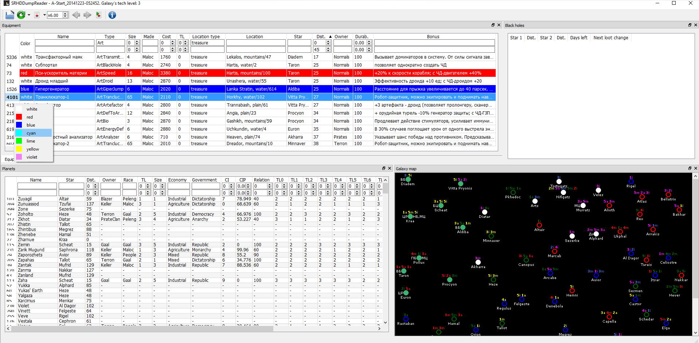

# Краткое описание:
Программа позволяет просматривать цены в галактике, всё оборудование и ошмётки, включая то, что закопано на планетах, одето на кораблях и доступно в продаже в магазинах.
Вторая функция - автоматическая стартовая генерация. Можно поставить прогу на ночь и она сгенерит несколько сотен стартовых галактик, к каждой сгенерирует короткий репорт: какие планеты сгенерились в стартовой части галактики, какие базы, какие арты закопаны поблизости на незаселёнках. Потом можно по всем этим репортам пройтись поиском и отобрать то, что нужно. Есть возможность настройки информации выводимой в репорт.
Для удобства есть функция QuickDump - быстрое сохранение дампа в игре (а-ля QuickSave): при запущенной игре и раскладке выставленной в английский нажмите F7. В папке с сейвами игры появится новый сейв (autodump.sav) и дамп к нему (autodump.txt).

[скачать SRHDDumpReader_x32][1]

[Видеообзор программы от alexkot](https://www.youtube.com/watch?v=M0gzWQGc3XE)

# Инструкция:
## Описание интерфейса:
[](SRHD_GUI_2016-05-17.png)

* Внизу программы есть строка состояния - там отображается текущее состояние программы и сообщения об ошибках. Если у вас что-то не работает - обратите внимание на то, что написано в строке состояния.
* На тулбаре есть кнопки в виде стрелок вперёд и назад - они позволяют открыть следующий и предыдущий по имени дамп в текущей папке в один клик.
* Насыщенность цвета в торговле - индикатор "выгодности". Чем насыщенней - тем выгодней.
* Все закладки можно двигать и андокнуть как отдельные окна и вообще тасовать как угодно (схватите и потяните).
* Закладки оборудования и планет поддерживают фильтрацию. Там где поле текстовое - можно вбить, что отображать (верхнее поле ввода) и что НЕ отображать (нижнее). На самом деле эти фильтры поддерживают полноценные регулярные выражения, но если вы с ними не знакомы - можно просто вбивать текст как при обычном поиске по тексту. Например, можно написать "Art|Nod", что означает Art или Nod. Если в колонке числовые значения - можно указать минимум и максимум.
* Программа рендерит карту галактики (она также сохраняется рядом с репортом в .png формате). Цвет системы на карте отображает то, кто её контролирует. Надписи над системой - список планет. Цифра - размер, буква - тип экономики, цвет - раса. Например гигантская (размер=5) гаальская индустриальная планет выглядит как 5i. Справа и слева - список баз. 

## Прицип работы функции QuickDump:
Программа эмулирует, будто Bы нажали ктрл+шифт+makedump, забьет "autodump" в качестве имени дампа, дождётся его сохранения и распарсит его.

## Автогенерация:
Что бы запустить автогенерацию галактики - нужно выйти в стартовое меню, выставить английскую раскладку клавиатуры и нажать F6. В настройках игры обязательно нужно выставить тип скриншотов - png. Первый прогон будет примерно 2 минуты т.к. программа замеряет, как долго на вашем ПК занимает генерация, затем программа будет подстраиваться и всё будет происходить быстрее. На моём ноутбуке полная итерация занимает ~63 секунды. Автогенератор делает скриншоты, что бы проверить, всё ли нормально и подстроить задержки, поэтому если что-то сбивается, то генерация остановится. Причина остановки отображается в строке состояния. Крайне важно что бы всё сработало нормально во время первого прогона, иначе референсные скриншоты будут неправильные. НО, проверка есть всего в двух местах: на стартовом меню и на экране с интро ("Добровольцы! Вы сделали..."). Программа сохраняет лог генерации в c:\Users\_USERNAME_\Documents\spacerangershd\SRHDDumpReader_generation.log. В логе отображается короткое описание по каждой итерации.
Если игра окажется неактивным окном (например, если Вы нажмёте альт-таб), то через некоторое время (до 60 сек) программа поймёт что что-то не так и остановится, о чём сообщит в строке состояния.
## Пресеты фильтров:
Настройки фильтров можно сохранять для быстрой загрузки, для этого нужно нажать правой кнопкой на заголовке таблицы (но не на поле ввода) и в контекстном меню выбрать save preset. Из того же контекстного меню их можно загружать. Пресеты фильтров также позволяют настраивать то, что именно выводится в репортах. В репорт сохраняется весь вывод программы, который соответствует заданным пресетам. Когда Вы сохраняете пресет - создается файл в папке программы, подпапке "presets". Имя файла = название пресета. В папке "presets" есть четыре подпапки:

* *equipment* - пресеты относящиеся к оборудованию - эти пресеты отображаются в контекстном меню, которое отображается по клику ПКМ на заголовке таблицы оборудования.
* *planets* - аналогично, но для планет.
* *equipmentReport* - в этой папке находятся те пресеты фильтров оборудования, которые будут выведены при сохранении репорта. Если вы хотите добавить свой пресет к репорту - его нужно скопировать в эту папку (из папки equipment).
* *planetsReport* - аналогично для планет.

На тулбаре справа от кнопки "сохранить репорт" есть стрелка, которая отображает выпадающее меню. В этом меню можно указать, хотите ли Вы что бы репорт сохранялся каждый раз при открытии дампа (требует немного дополнительного времени) или только во время автогенерации или если Вы сами нажмёте "сохранить репорт".

## Настройка цветовой схемы карты:
У пользователя есть возможность меня цвета используемые при отрисовке карты. Цветовая схема храниться в файле map_colors.json в папке программы. Формат файла - пары ключ-значение где ключ - это модификатор+раса-владелец, а значение - цвет. Примером может послужить тот файл, что идёт вместе с программой по умолчанию.
Цвет можно указывать в разных форматах:
```
   #RGB (каждая из буков R, G, and B - одна шестнадцатеричная цифра)
   #RRGGBB
   #AARRGGBB (AA - прозрачность)
   #RRRGGGBBB
   #RRRRGGGGBBBB
   Имя цвета по стандарту World Wide Web Consortium [2], например "steelblue" или "gainsboro"
   transparent - прозрачный.
```
Технический нюанс: в дампе размер планет задаётся числами от 60 до 100, для удобства в программе 60->1, а 100->5.

# Установка:
Скачать, распаковать и запустить.

## Инструкция по калибровке для слабых компов:
Открыть редактор реестра: win+r; regedit; OK
Перейти в ветку игры: HKCU\Software\p-s team\SRHDDumpReader
Увеличить значения параметров ShortSleepTime и MaxGenerationTime. По умолчанию они составляют 25 мсек и 120000мсек=2мин.
Попробуйте поставить 50мсек и 240000мсек соответсвенно. Подбирать значение нужно под свой комп.

[github](https://github.com/mdimura/SRHDDumpReader)

[1]: https://github.com/mdimura/SRHDDumpReader/releases
[2]: http://www.w3.org/TR/SVG/types.html#ColorKeywords